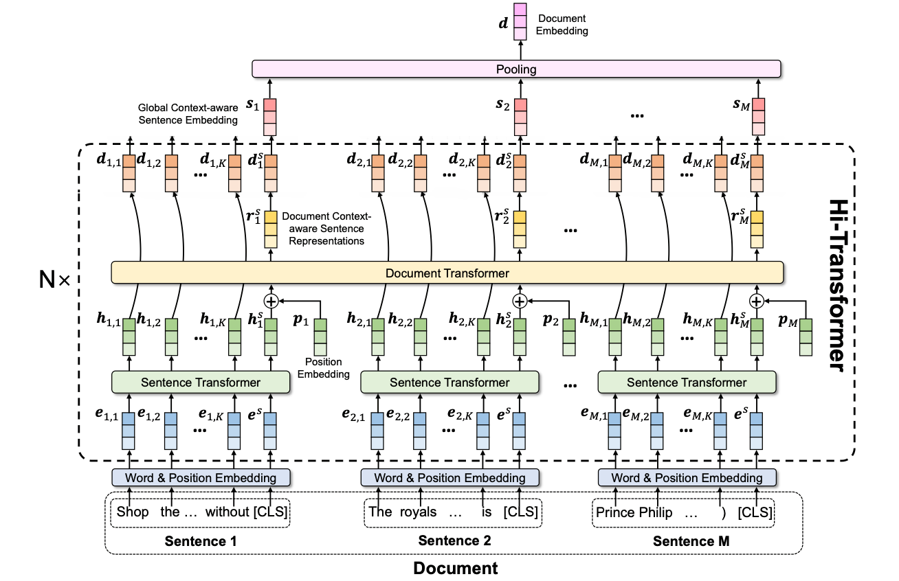

# Hi-Transformers (Hierarchical Transformers)

A simplified re-implementation of the architecture proposed in the work "Hi-Transformer: Hierarchical Interactive Transformer for Efficient and Effective Long Document Modeling" by Wu et al. (2021) (https://aclanthology.org/2021.acl-short.107/).



The repository supports two variants of the `Hi-Transformer` architecture:

* `Hi-Transformer`: Stacked paired (1-by-1) sentence (S), document (D) encoders, e.g., a 6-layer model has 12 effective transformer blocks (Layout: SD/SD/SD/SD/SD/SD)
* `Hi-Transformer (V2)`: Stacked paired (N-by-1) sentence (S), document (D) encoders, where the pairing (or skipping) of document encoders is controlled by a parameter (`document_contextualization_factor`), e.g., a 6-layer model with a `document_contextualization_factor=3` has 8 effective transformer blocks (Layout: S/S/SD/S/S/SD)

### Requirements

Make sure that all required packages are installed:

```
torch>=1.11.0
transformers>=4.15.0
datasets>=2.0.0
tokenizers>=0.11.0
scikit-learn>=1.0.0
tqdm>=4.62.0
```

### How to run experiments?

So far, we are testing the core implementations, you can play around with the following scripts:

* `Hi-Transformer`: `/models/hi-transformer/validate_hi_transformer.py`
* `Hi-Transformer (V2)`: `/models/hi-transformer/validate_hi_transformer_v2.py`

You can also try to train a new LM based on either `Hi-Transformer` variants:

* `Hi-Transformer`: `train_hi_transformer.sh`
* `Hi-Transformer (V2)`: `train_hi_transformer_v2.sh`

### I still have open questions...

Please post your question on [Discussions](https://github.com/coastalcph/hi-transformers/discussions) section or communicate with the corresponding author via e-mail.
