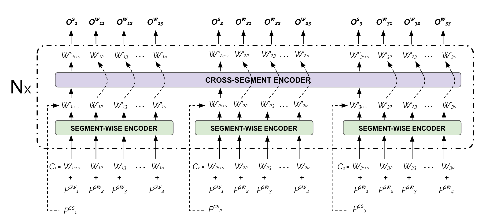
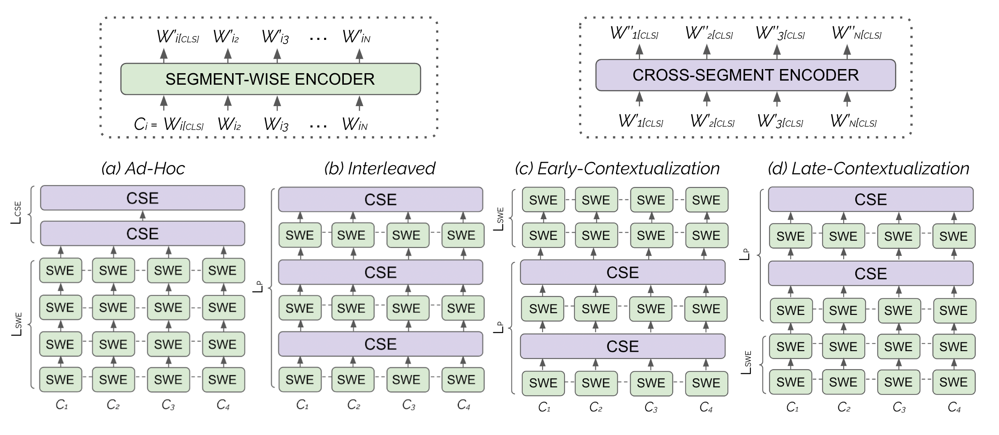

# Hierarchical Attention Transformers (HATs)

Implementation of Hierarchical Attention Transformers (HATs) presented in _"An Exploration of Hierarchical Attention Transformers for Efficient Long Document Classification"_ of Chalkidis et al. (2022). HAT use a hierarchical attention scheme, which is a combination of segment-wise and cross-segment attention operations. You can think segments as paragraphs or sentences.




## Citation

```
@misc{chalkidis-etal-2022-hat,
  url = {https://arxiv.org/abs/xxx},
  author = {Chalkidis, Ilias and Dai, Xiang and Fergadiotis, Manos and Malakasiotis, Prodromos and Elliott, Desmond},
  title = {An Exploration of Hierarchical Attention Transformers for Efficient Long Document Classification},
  publisher = {arXiv},
  year = {2022},
}
```

## Implementation Details

The repository supports several variants of the HAT architecture. The implementation of HAT is build on top of HuggingFace Transformers in Torch. The implementations is available at `models/hat/modelling_hat.py`.  The layout of stacking segment-wise (SW) and cross-segment (CS) encoders is specified in the configuration file with the `encoder_layout` parameter. 




* **_Ad-Hoc (AH):_**   An ad-hoc (partially pre-trained) HAT comprises an initial stack of shared L-SWE segment encoders from a pre-trained transformer-based model, followed by L-CSE ad-hoc segment-wise encoders. In this case the model initially encodes and contextualize token representations per segment, and then builds higher-order segment-level representationse.g., a 6-layer model has 12 effective transformer blocks (Layout: S/S/S/S/S/S/S/S/D/D/D/D).

```json
"encoder_layout": {
"0": {"sentence_encoder": true, "document_encoder":  false},
"1": {"sentence_encoder": true, "document_encoder":  false},
"2": {"sentence_encoder": true, "document_encoder":  false},
"3": {"sentence_encoder": true, "document_encoder":  false},
"4": {"sentence_encoder": true, "document_encoder":  false},
"5": {"sentence_encoder": true, "document_encoder":  false},
"6": {"sentence_encoder": true, "document_encoder":  false},
"7": {"sentence_encoder": true, "document_encoder":  false},
"8": {"sentence_encoder": false, "document_encoder":  true},
"9": {"sentence_encoder": false, "document_encoder":  true},
"10": {"sentence_encoder": false, "document_encoder":  true},
"11": {"sentence_encoder": false, "document_encoder":  true}
}
```

* **_Interleaved (I):_**  An interleaved HAT comprises a stack of L paired segment-wise and cross-segment encoders.
e.g., a 6-layer model has 12 effective transformer blocks (Layout: SD/SD/SD/SD/SD/SD).

```json
"encoder_layout": {
"0": {"sentence_encoder": true, "document_encoder":  true},
"1": {"sentence_encoder": true, "document_encoder":  true},
"2": {"sentence_encoder": true, "document_encoder":  true},
"3": {"sentence_encoder": true, "document_encoder":  true},
"4": {"sentence_encoder": true, "document_encoder":  true},
"5": {"sentence_encoder": true, "document_encoder":  true}
}
```
* **_Early-Contextualization (EC):_** n early-contextualized HAT comprises an initial stack of L-P paired segment-wise and cross-segment encoders, followed by a stack of L-SWE segment-wise encoders. In this case, cross-segment attention (contextualization) is only performed at the initial layers of the model,e.g., a 6-layer model and 8 effective transformer blocks (Layout: SD/SD/S/S/S/S).

```json
"encoder_layout": {
"0": {"sentence_encoder": true, "document_encoder":  true},
"1": {"sentence_encoder": true, "document_encoder":  true},
"2": {"sentence_encoder": true, "document_encoder":  false},
"3": {"sentence_encoder": true, "document_encoder":  false},
"4": {"sentence_encoder": true, "document_encoder":  false},
"5": {"sentence_encoder": true, "document_encoder":  false}
}
```


* **_Late-Contextualization (LC):_**  A late-contextualized HAT comprises an initial stack of $L_{\mathrm{SWE}}$ segment-wise encoders, followed by a stack of  $L_{\mathrm{P}}$ paired segment and segment-wise encoders. In this case, cross-segment attention (contextualization) is only performed in the latter layers of the model, e.g., a 6-layer model and 8 effective transformer blocks (Layout: S/S/S/S/SD/SD).


```json 
"encoder_layout": {
"0": {"sentence_encoder": true, "document_encoder":  false},
"1": {"sentence_encoder": true, "document_encoder":  false},
"2": {"sentence_encoder": true, "document_encoder":  false},
"3": {"sentence_encoder": true, "document_encoder":  false},
"4": {"sentence_encoder": true, "document_encoder":  true},
"5": {"sentence_encoder": true, "document_encoder":  true}
}
```

In thi study, we examine the efficacy of 8 alternative layouts:

```json
LAYOUTS = {
    'I1': 'SD|SD|SD|SD|SD|SD',
    'I2': 'S|SD|D|S|SD|D|S|SD|D',
    'I3': 'S|SD|S|SD|S|SD|S|SD',
    'LC1': 'S|S|S|S|S|S|SD|SD|SD',
    'LC2': 'S|S|S|S|S|SD|D|S|SD|D',
    'EC1': 'S|S|SD|D|S|SD|D|S|S|S',
    'EC2': 'S|S|SD|SD|SD|S|S|S|S',
    'AH':  'S|S|S|S|S|S|S|S|S|S|S|S',
}

```

## Available Models on HuggingFace Hub

| Model Name                                                                                                                                  | Layers | Hidden Units | Attention Heads | Vocab | Parameters |
|---------------------------------------------------------------------------------------------------------------------------------------------|--------|--------------|-----------------|-------|------------|
| [`kiddothe2b/hierarchical-transformer-base-4096`](https://huggingface.co/kiddothe2b/hierarchical-transformer-base-4096)                     | 16     | 768          | 12              | 50K   | 152M       |
| [`kiddothe2b/longformer-base-4096`](https://huggingface.co/kiddothe2b/longformer-base-4096)                                                 | 12     | 768          | 12              | 50K   | 152M       |
| [`kiddothe2b/adhoc-hierarchical-transformer-base-4096`](https://huggingface.co/kiddothe2b/adhoc-hierarchical-transformer-base-4096)         | 16     | 768          | 12              | 50K   | 140M       |
| [`kiddothe2b/adhoc-hierarchical-transformer-I1-mini-1024`](https://huggingface.co/kiddothe2b/adhoc-hierarchical-transformer-I1-mini-1024)   | 12     | 256          | 4               | 32K   | 18M        |
| [`kiddothe2b/adhoc-hierarchical-transformer-I3-mini-1024`](https://huggingface.co/kiddothe2b/adhoc-hierarchical-transformer-I2-mini-1024)   | 12     | 256          | 4               | 32K   | 18M        |
| [`kiddothe2b/adhoc-hierarchical-transformer-LC1-mini-1024`](https://huggingface.co/kiddothe2b/adhoc-hierarchical-transformer-LC1-mini-1024) | 12     | 256          | 4               | 32K   | 18M        |
| [`kiddothe2b/adhoc-hierarchical-transformer-EC2-mini-1024`](https://huggingface.co/kiddothe2b/adhoc-hierarchical-transformer-EC2-mini-1024) | 12     | 256          | 4               | 32K   | 18M        |
| [`kiddothe2b/longformer-mini-1024`](https://huggingface.co/kiddothe2b/longformer-mini-1024)                                                 | 6      | 256          | 4               | 32K   | 14M        |


## Requirements

Make sure that all required packages are installed:

```
torch>=1.11.0
transformers>=4.18.0
datasets>=2.0.0
tokenizers>=0.11.0
scikit-learn>=1.0.0
tqdm>=4.62.0
nltk>=3.7.0
```

## How to run experiments?

You can use the shell scripts provided in the `running_scripts` directory to pre-train new models or fine-tune the ones released.

Try on Google Colab: https://colab.research.google.com/drive/15feh49wqBshgkcvbO6QypvJoa3dG6P5S?usp=sharing

### I still have open questions...

Please post your question on [Discussions](https://github.com/coastalcph/hi-transformers/discussions) section or communicate with the corresponding author via e-mail.
